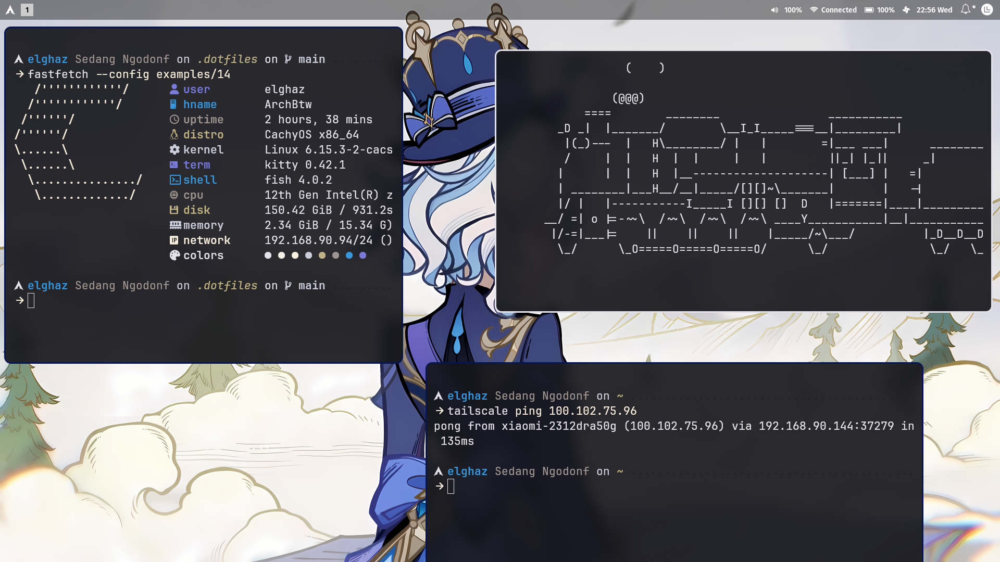

# 🛠️ ElghazX's Dotfiles

Konfigurasi sistem Linux milik pribadi yang digunakan di **CachyOS** dengan window manager **Hyprland**. Setup ini awalnya berbasis dari proyek [ml4w (My Linux 4 Work)](https://github.com/mylinuxforwork/dotfiles.git), lalu dimodifikasi sesuai dengan preferensiku sendiri.

---

## ✨ Fitur Utama

- ✅ Menggunakan **Hyprland** (dynamic tiling Wayland WM)
- ✅ Tema otomatis berdasarkan wallpaper (`matugen`, `wallust`)
- ✅ Launcher cantik pakai `rofi`
- ✅ Bar minimalis dengan `waybar`
- ✅ Terminal: `kitty` + `starship`
- ✅ Editor utama: `neovim` dengan plugin-plugin pilihan
- ✅ Shell: `fish`
- ✅ Notification: `dunst` + `swaync`

---

## 🧰 Komponen dalam Dotfiles

Berikut beberapa direktori penting dalam repo ini:

```bash
.config/
├── hypr/ → konfigurasi Hyprland
├── rofi/ → launcher dengan tema custom
├── waybar/ → bar informasi untuk Hyprland
├── dunst/ → notifikasi ringan
├── swaync/ → notification center modern
├── starship/ → prompt shell universal
├── kitty/ → terminal dengan GPU acceleration
├── mpv/ → media player config
├── nvim/ → Neovim setup (Lua-based)
├── fish/ → shell config
├── matugen/ → auto theme generator dari wallpaper
├── wallust/ → sinkronisasi warna tema UI
├── qt6ct/ → konfigurasi tampilan Qt apps
├── wl-gout/ → logout GUI
├── wal/ → template untuk wal
└── ...
```
---

## 🚀 Setup dari Awal

### 1. Persiapan Sistem

Install CachyOS (atau distro Arch-based lainnya seperti Arch, EndeavourOS, Manjaro). Setelah sistem terpasang:

Update Repository
```bash
sudo pacman -Syu
```

Pastikan kamu sudah menginstal package dasar

Install Hyprland
```bash
# Paket utama
sudo pacman -S hyprland 
```

Install git
```bash
sudo pacman -S git base-devel
```
### 2. Clone Dotfiles
```bash
git clone https://github.com/ElghazX/.dotfiles.git ~/.dotfiles
cd ~/.dotfiles
```
### 3. Install Dependencies
Install package manager buat AUR, bisa Paru atau Yay

Paru: 
```bash
sudo pacman -S --needed base-devel git
git clone https://aur.archlinux.org/paru.git ~/paru
cd ~/paru
makepkg -si
```
Install Semua paket yang dibutuhkan
```bash
paru -S --noconfirm \
  wget unzip gum rsync git figlet xdg-user-dirs \
  hyprland hyprpaper hyprlock hypridle hyprpicker \
  noto-fonts noto-fonts-emoji noto-fonts-cjk noto-fonts-extra \
  xdg-desktop-portal-hyprland xdg-desktop-portal-gtk \
  libnotify kitty qt5-wayland qt6-wayland uwsm fastfetch \
  eza python-pip python-gobject python-screeninfo tumbler \
  brightnessctl nm-connection-editor network-manager-applet \
  gtk4 libadwaita fuse2 imagemagick jq xclip neovim htop \
  rust cargo blueman grim slurp cliphist nwg-look qt6ct \
  waybar rofi-wayland polkit-gnome zsh zsh-completions fzf \
  pavucontrol papirus-icon-theme breeze flatpak swaync gvfs \
  wlogout hyprshade waypaper grimblast-git bibata-cursor-theme-bin \
  pacseek otf-font-awesome ttf-fira-sans ttf-fira-code \
  ttf-firacode-nerd ttf-dejavu nwg-dock-hyprland \
  checkupdates-with-aur loupe power-profiles-daemon \
  python-pywalfox
```
Install Tools via `cargo`
```bash
cargo install matugen
cargo install wallust
```

### 4. Salin atau Symlink Config
```bash
sudo pacman -S stow 
```
Kemudian pakai stow untuk mengelola package
```bash
stow dunst fastfetch fish git gtk-3.0 gtk-4.0 hypr kitty matugen mpv nvim qt6ct rofi starship swaync tmux wal wallust waybar waypaper wlogout xsettingsd
```

### 5. Ganti shell ke Fish (opsional)
```bash
chsh -s $(which fish)
```

## 🖼️ Tema & Wallpaper
- Wallpaper dikontrol menggunakan waypaper
- Tema warna otomatis menggunakan matugen + wallust
- Notifikasi ditangani swaync dan dunst
- Tampilan Qt diatur melalui qt6ct

## 🔧 Tips Tambahan
- Jika bar tidak muncul → pastikan waybar dijalankan dari autostart Hyprland
- Jika tema tidak berubah otomatis → cek apakah matugen dan wallust terpasang dan dipanggil di script wallpaper
- Tambahkan ~/.config/hypr/autostart.conf jika perlu script startup
