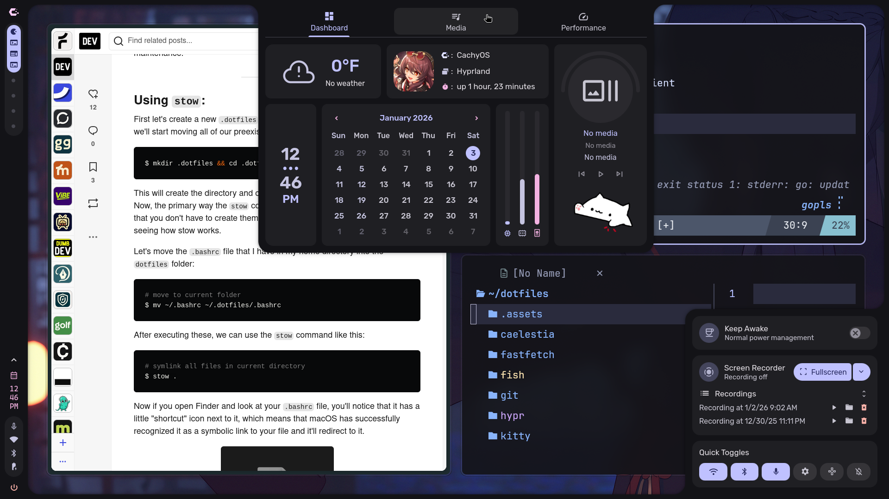

# ElghazX's Dotfiles

Personal Linux configuration with **Hyprland** window manager.

## Features

- **Hyprland** - Wayland compositor
- **Auto theming** - Colors from wallpaper using `matugen` & `wallust`
- **Rofi** - Application launcher
- **Waybar** - Status bar
- **Kitty** + **Starship** - Terminal setup
- **Neovim** - Text editor
- **Fish** - Shell
- **Swaync** - Notifications
- **Fastfetch** - System info
- **Tmux** - Terminal multiplexer
- **MPV** - Media player
- **Spicetify** - Spotify theming

## Installation

1. Install dependencies:
```bash
paru -S hyprland waybar rofi-wayland kitty neovim fish starship swaync matugen wallust fastfetch tmux mpv spicetify-cli stow
```

2. Clone and setup:
```bash
git clone https://github.com/ElghazX/.dotfiles.git ~/.dotfiles
cd ~/.dotfiles
stow hypr waybar rofi kitty nvim fish starship swaync fastfetch tmux mpv spicetify matugen wallust wal waypaper wlogout qt6ct xsettingsd
```

3. Change shell (optional):
```bash
chsh -s $(which fish)
```
